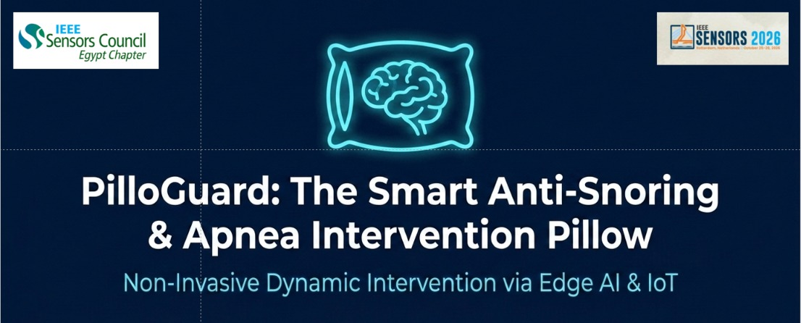

# 💤 PilloGuard
## AI-Powered Closed-Loop Pneumatic Sleep Assistance System

<p align="center">
  
</p>

<p align="center">
  <b>From passive sleep monitoring to intelligent, closed-loop pneumatic intervention.</b>
</p>

<p align="center">
  <b>MYOSA 6.0 × IEEE Sensors Council</b>
</p>

---

## 🎯 Overview

PilloGuard is an intelligent sleep-assistance prototype developed during the **MYOSA 6.0 Development Phase**, organized by the **IEEE Sensors Council**.

The system combines:

- 🧠 Artificial Intelligence & Machine Learning
- ⚙️ ESP32 embedded control
- 🎙️ AI-based snoring detection
- ❤️ Physiological monitoring
- 🧭 Head-position and movement tracking
- 📡 Bluetooth Low Energy (BLE)
- 🎈 Pneumatic actuation
- 📊 Closed-loop pressure feedback
- 📱 Flutter mobile application
- 💾 Local sleep-session storage
- 🛠️ MYOSA Mini Kit integration

The core concept is:

> **Sense → Analyze → Decide → Intervene → Measure Feedback → Respond**

Unlike passive sleep-monitoring systems that only collect and display information, PilloGuard is designed around an **active closed-loop intervention concept**, where detected events and sensor feedback can be used to control targeted pneumatic pillow zones.

---

# 🧠 System Architecture

PilloGuard follows a closed-loop control philosophy:

```text
                         ┌─────────────────────┐
                         │   Monitoring Layer  │
                         └──────────┬──────────┘
                                    │
              ┌─────────────────────┼─────────────────────┐
              │                     │                     │
              ▼                     ▼                     ▼
      ┌──────────────┐      ┌──────────────┐      ┌──────────────┐
      │  Microphone  │      │ Physiological│      │   Motion &   │
      │  / Snoring   │      │  Monitoring  │      │  Orientation │
      └──────┬───────┘      └──────┬───────┘      └──────┬───────┘
             │                     │                     │
             │                     ▼                     │
             │              ┌──────────────┐             │
             │              │ Smartwatch   │             │
             │              │              │             │
             │              │ • SpO₂       │             │
             │              │ • Heart Rate │             │
             │              └──────┬───────┘             │
             │                     │                     │
             └─────────────────────┼─────────────────────┘
                                   │
                                   ▼
                         ┌─────────────────────┐
                         │   AI / Decision     │
                         │       Layer         │
                         └──────────┬──────────┘
                                    │
                                    ▼
                         ┌─────────────────────┐
                         │        ESP32        │
                         │  Control & Sensing  │
                         └──────────┬──────────┘
                                    │
                         ┌──────────┴──────────┐
                         │                     │
                         ▼                     ▼
                  ┌─────────────┐       ┌──────────────┐
                  │   Relays    │       │   Pressure   │
                  └──────┬──────┘       │   Sensors    │
                         │              └──────┬───────┘
                         ▼                     │
                    ┌─────────┐                │
                    │  Pumps  │                │
                    └────┬────┘                │
                         │                     │
                         ▼                     │
                ┌─────────────────┐            │
                │    Pneumatic    │◄───────────┘
                │  Bladder Zones  │
                └─────────────────┘
```

---

# 🔄 Closed-Loop Control

The complete intervention cycle is:

```text
┌──────────────────────────────┐
│        Sense Event           │
│ Snoring / Physiological Data │
└──────────────┬───────────────┘
               │
               ▼
┌──────────────────────────────┐
│          Analyze             │
│ AI + Sensor Data Processing  │
└──────────────┬───────────────┘
               │
               ▼
┌──────────────────────────────┐
│           Decide             │
│ Is intervention required?    │
└──────────────┬───────────────┘
               │
               ▼
┌──────────────────────────────┐
│     Select Pillow Zone       │
└──────────────┬───────────────┘
               │
               ▼
┌──────────────────────────────┐
│        Activate Pump         │
└──────────────┬───────────────┘
               │
               ▼
┌──────────────────────────────┐
│      Read Pressure Sensor    │
└──────────────┬───────────────┘
               │
               ▼
┌──────────────────────────────┐
│   Target Pressure Reached?   │
└──────────────┬───────────────┘
               │
               ▼
┌──────────────────────────────┐
│        Stop Inflation        │
└──────────────┬───────────────┘
               │
               ▼
┌──────────────────────────────┐
│       Monitor Again          │
└──────────────┬───────────────┘
               │
               └──────────────► Continue Closed Loop
```

This feedback mechanism is one of the main engineering concepts behind PilloGuard.

---

# 🚀 Key Features

## 🎙️ 1. AI-Based Snoring Detection

PilloGuard uses the mobile device microphone to detect snoring events.

The audio stream is processed using a machine-learning-based audio classification approach.

The system can determine:

- Whether a snoring event is detected
- Snore probability
- Timestamp of the detected event

Instead of continuously storing raw audio, the monitoring workflow focuses on extracting relevant events and probabilities.

This allows snoring activity to be correlated with physiological and movement information.

---

## ❤️ 2. Physiological Monitoring

Physiological monitoring provides additional context during an active sleep session.

### ⌚ Smartwatch

A smartwatch is used for physiological monitoring and provides:

- Blood Oxygen Saturation (SpO₂)
- Heart Rate

These measurements can be considered alongside snoring and movement events to build a more complete sleep-monitoring timeline.

---

## 🧭 3. Head Position & Movement Tracking

The **MPU6050 Accelerometer + Gyroscope** is used to monitor head movement and orientation.

The measured movement and orientation can be used by the control logic to determine the appropriate pneumatic intervention zone.

Instead of activating all pillow zones simultaneously, the system can target the corresponding region based on the detected position.

---

# 🎈 4. Three-Zone Pneumatic Pillow

The PilloGuard pillow contains **three independently controlled pneumatic bladder zones**.

Each zone follows the control chain:

```text
Pump
  │
  ▼
Relay
  │
  ▼
Pneumatic Bladder
  │
  ▼
Pressure Sensor
  │
  ▼
ESP32
```

This allows the system to provide targeted pneumatic intervention instead of continuously inflating the entire pillow.

Each pneumatic zone can be controlled independently according to the detected head position and system decision.

---

# 📊 5. Individual Pressure Feedback

Each pneumatic bladder is connected to an individual pressure sensor.

The prototype uses compact piezo-resistive pressure modules with a nominal measurement range of:

> **0–40 kPa**

The ESP32 continuously monitors the pressure of each bladder.

When the required pressure condition is reached, the corresponding pump can be stopped.

This converts the pneumatic subsystem from a simple open-loop actuator into a **feedback-based pressure-controlled system**.

---

# 🛠️ MYOSA Mini Kit Integration

PilloGuard uses the **MYOSA Mini Kit** as part of its embedded sensing, control, and local monitoring platform.

The MYOSA ESP32-based motherboard acts as the main embedded controller and sensor interface.

## MYOSA Components Used

| MYOSA Component | Function in PilloGuard |
|---|---|
| **MYOSA ESP32 Motherboard** | Main embedded controller and sensor interface |
| **OLED / SSD1306** | Local system status and sensor feedback |
| **BMP180** | Local pressure and temperature measurements |
| **APDS9960** | Ambient light, proximity, and gesture sensing |

### 🖥️ OLED Display

The OLED provides local feedback from the embedded system, allowing important sensor and system information to be displayed directly on the hardware.

### 🌡️ BMP180

The BMP180 provides:

- Pressure measurements
- Temperature measurements

These measurements are used as part of the local MYOSA sensing layer.

### 💡 APDS9960

The APDS9960 provides:

- Ambient light sensing
- Proximity detection
- Gesture sensing

### 🧭 MPU6050

The MPU6050 is used for:

- Accelerometer measurements
- Gyroscope measurements
- Head movement information
- Orientation information

The MPU6050 is used as an additional motion-sensing component for the PilloGuard control system.

---

# 🧠 AI Decision Layer

The AI processing layer can combine information from multiple sources:

```text
Snoring Detection
       +
Snore Probability
       +
SpO₂
       +
Heart Rate
       +
Head Position
       +
Head Movement
       +
Pressure Feedback
       +
Previous Intervention State
       │
       ▼
┌──────────────────────┐
│   AI / Decision Layer│
└──────────┬───────────┘
           │
           ▼
┌──────────────────────┐
│ Intervention Decision│
└──────────────────────┘
```

The decision layer determines whether the system should remain inactive or initiate a targeted pneumatic intervention.

The objective is to combine multiple signals rather than relying on a single measurement.

---

# 📱 Smart Mobile Application

The PilloGuard mobile application is developed using **Flutter / Dart**.

The application provides a dark-mode monitoring dashboard for sleep-session visualization and monitoring.

During an active sleep session, it can display information such as:

- Snoring status
- Snore probability
- SpO₂
- Heart rate
- Head movement
- Sensor connection status
- Intervention events
- Sleep-session information

The application is also designed to support background monitoring so that monitoring can continue while the application is minimized or the device screen is locked.

---

# 📡 Bluetooth Low Energy

**Bluetooth Low Energy (BLE)** provides wireless communication between supported monitoring hardware and the mobile application.

BLE is used as part of the system's communication layer for transferring relevant monitoring information while maintaining a low-power wireless connection.

---

# 💾 Local Sleep Data Storage

Sleep-monitoring information is stored locally using:

**SQLite / sqflite**

Timestamped information can be correlated across:

- Snoring events
- SpO₂
- Heart rate
- Movement
- Head position
- Intervention events

This creates a time-series representation of a sleep session and provides a foundation for future visualization and sleep analysis.

---

## 🎬 Demo / Examples

### 📷 Project Images

#### Hardware Prototype — Front View

<p align="center">
  
</p>

*Front view of the PilloGuard hardware prototype, showing the pillow, pneumatic system, sensors, and embedded control hardware.*

---

#### Hardware Prototype — Full Setup

<p align="center">
  
</p>

*Complete PilloGuard prototype setup, including the MYOSA platform, pneumatic actuation system, pressure-feedback components, and monitoring hardware.*

---

### 🎥 Project Demonstration

The complete project demonstration is included in the repository:

**[▶️ Watch PilloGuard Demo](./pilloguard-demo.mp4)**

---

### 🎥 Arabic-Translated Demonstration

An Arabic-translated version of the project demonstration is also included for easier understanding:

**[▶️ Watch Arabic-Translated Demo](./pilloguard-demo-translated.mp4)**

This version presents the same project demonstration with Arabic translation while preserving the original technical content.---

# ⚙️ Usage Instructions

## 🔧 Hardware Setup

1. Connect the MYOSA ESP32 motherboard.
2. Connect the MYOSA Mini Kit components.
3. Connect the MPU6050 for movement and orientation tracking.
4. Connect the three pneumatic pressure sensors.
5. Connect the three pumps through relay modules.
6. Prepare the smartwatch for physiological monitoring.
7. Power the prototype according to the implemented hardware configuration.
8. Upload the ESP32 firmware.

---

# 💻 ESP32 Firmware

The embedded firmware is provided in:

```text
pilloguard_esp32.ino
```

## Installation

1. Install Arduino IDE.
2. Install the ESP32 board package.
3. Install the required sensor libraries.
4. Open `pilloguard_esp32.ino`.
5. Select the appropriate ESP32 board.
6. Select the correct serial port.
7. Upload the firmware.

---

# 📱 Mobile Application

The mobile application requires:

- Flutter SDK
- Dart
- Android/iOS development environment
- Required Flutter dependencies

Install dependencies:

```bash
flutter pub get
```

Run the application:

```bash
flutter run
```

---

# 🛠️ Technology Stack

| Category | Technologies |
|---|---|
| **Embedded** | ESP32, Arduino/C++ |
| **MYOSA** | MYOSA Mini Kit |
| **Motion** | MPU6050 |
| **Local Sensors** | BMP180, APDS9960 |
| **Display** | OLED / SSD1306 |
| **Pneumatics** | Pumps, Relays, 0–40 kPa Pressure Sensors |
| **Physiological** | Smartwatch, SpO₂, Heart Rate |
| **AI** | Machine Learning, TensorFlow Lite, YAMNet |
| **Mobile** | Flutter, Dart |
| **Communication** | Bluetooth Low Energy (BLE) |
| **Background Monitoring** | Flutter Background Service |
| **Storage** | SQLite / sqflite |

---

# 🧩 System Data Flow

```text
                         ┌──────────────┐
                         │  Microphone  │
                         └──────┬───────┘
                                │
                                ▼
                      ┌───────────────────┐
                      │ Snoring Detection │
                      └─────────┬─────────┘
                                │
                                │
              ┌─────────────────┴─────────────────┐
              │                                   │
              ▼                                   ▼
    ┌────────────────────┐              ┌────────────────┐
    │ Physiological      │              │    MPU6050     │
    │ Monitoring         │              │ Movement &     │
    │                    │              │ Orientation    │
    └─────────┬──────────┘              └───────┬────────┘
              │                                 │
              ▼                                 │
       ┌──────────────┐                          │
       │ Smartwatch   │                          │
       │              │                          │
       │ • SpO₂       │                          │
       │ • Heart Rate │                          │
       └──────┬───────┘                          │
              │                                  │
              └────────────────┬─────────────────┘
                               │
                               ▼
                    ┌────────────────────┐
                    │  AI / Decision     │
                    │       Layer        │
                    └─────────┬──────────┘
                              │
                              ▼
                         ┌─────────┐
                         │  ESP32  │
                         └────┬────┘
                              │
                     ┌────────┴────────┐
                     │                 │
                     ▼                 ▼
                ┌─────────┐     ┌───────────────┐
                │ Relays  │     │    Pressure   │
                └────┬────┘     │    Sensors    │
                     │          └───────┬───────┘
                     ▼                  │
                ┌─────────┐             │
                │  Pumps  │◄────────────┘
                └────┬────┘
                     │
                     ▼
             ┌──────────────────┐
             │ Pneumatic Pillow │
             │   3 Zones        │
             └──────────────────┘
```

---

# 🔁 Intervention Logic

The intervention workflow can be summarized as:

```text
Snoring / Abnormal Event
          │
          ▼
AI + Sensor Analysis
          │
          ▼
Intervention Decision
          │
          ▼
Determine Head Position
          │
          ▼
Select Appropriate Zone
          │
          ▼
Activate Corresponding Pump
          │
          ▼
Read Pressure Feedback
          │
          ▼
Target Condition Reached?
          │
          ▼
Stop Inflation
          │
          ▼
Monitor User Response
          │
          ▼
Continue Monitoring
          │
          └──────────────► Closed Loop
```

---

# 🛡️ Safety-Oriented Design

The pneumatic subsystem is designed around continuous pressure feedback.

Each bladder has an individual pressure measurement channel.

The controller can:

- Monitor bladder pressure
- Determine whether the target condition is reached
- Stop the corresponding pump
- Continue monitoring after intervention

This feedback-based approach is intended to prevent uncontrolled continuous inflation and keep the intervention targeted.

> **PilloGuard is an engineering prototype and is not intended to replace professional medical diagnosis, treatment, or clinical sleep studies.**

---

# 📁 Repository Structure

```text
pilloguard/
│
├── README.md
├── pilloguard.md
├── pilloguard_esp32.ino
│
├── cover.jpeg
├── pilloguard_system.jpg
│
├── hardware/
│   └── hardware.jpg
│
├── pilloguard-demo.mp4
└── pilloguard-demo-translated.mp4
```

---

# 👥 Team PilloGuard

## Team Members

### Mahmoud Ibrahim
**AI / Embedded Systems / System Integration**

### Mohamed Hamdy
**Team Member**

### Abdelrahman Taha
**Team Member**

### Mohamed Alaa
**Team Member**

---

## 🤝 Special Thanks

Special thanks to **Ahmad Elshafee** for his valuable support and contribution throughout the project.

We also acknowledge the **MYOSA Sensors team** for providing the MYOSA platform and sensor development ecosystem that supported the development and prototyping of PilloGuard.

---

# 🏆 MYOSA 6.0

PilloGuard was developed during the **MYOSA 6.0 Development Phase**, organized by the **IEEE Sensors Council**.

The project provided hands-on experience across:

**Artificial Intelligence • Embedded Systems • Sensors • IoT • BLE • Pneumatic Control • Mobile Development • Hardware Integration**

---

# 📖 Full Technical Documentation

For the complete technical project blog:

👉 **[Read the Full PilloGuard Project Blog](./pilloguard.md)**

The full technical documentation includes detailed explanations of the system architecture, sensing layer, pneumatic subsystem, pressure feedback, AI processing, mobile application, and implementation workflow.

---

# 📌 Project Status

**Prototype / Development Phase**

PilloGuard is an engineering prototype developed as part of the **MYOSA 6.0 Development Phase**.

The current prototype demonstrates the integration of:

**AI + Embedded Systems + Physiological Monitoring + Motion Sensing + Pneumatic Control + Mobile Monitoring + Closed-Loop Feedback**

---

<p align="center">
  <b>💤 PilloGuard</b>
</p>

<p align="center">
  <i>From passive sleep monitoring to intelligent,<br>
  closed-loop pneumatic intervention.</i>
</p>

<p align="center">
  <b>MYOSA 6.0 × IEEE Sensors Council</b>
</p>
